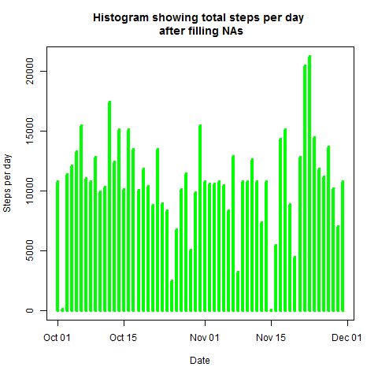
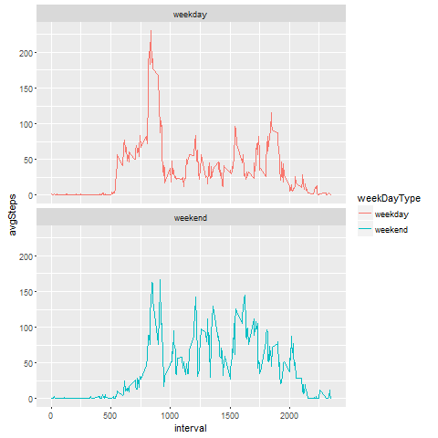

## Loading and preprocessing the data
Clear workspace using rm command as:
```r
rm(list = ls())
```
Unzip the activity dataset as:
```r
unzip(zipfile = "activity.zip")
```
Load the data into activity dataframe using read.csv() as:
```r
activity <- read.csv("data/activity.csv")
```
Convert date column of activity dataframe from factor to Date as:
```r
activity$date <- as.Date(activity$date)
```

## What is mean total number of steps taken per day?
Load dplyr package that will be used for manipulating data as:
```r
library('dplyr')
```
#### 1. Calculate the total number of steps taken per day (ignored the missing values)
Calculate total steps per day by first filtering days with NA steps, then grouping by date and finally calculating total steps for the day as:
```r
stepsPerDay <- activity %>% filter(!is.na(steps)) %>% group_by(date) 
%>% summarise(totalSteps = sum(steps))
```
####2. Make a histogram of the total number of steps taken each day
The histogram for the total steps  doesnot show days with 0 steps as we have ignored them, the code for histogram plot is shown below:
```r
plot(stepsPerDay$date, stepsPerDay$totalSteps,xlab = "Date", ylab = "Steps per day",
type = "h",col = 'green',lwd = 4)
```
 
####3.Calculate and report the mean and median of the total number of steps taken per day
Mean and median of total steps taken per day are calculated as:
```r
meanSteps <- mean(stepsPerDay$totalSteps)
medianSteps <- median(stepsPerDay$totalSteps)
```
The calculated mean and median are 10766.19 and 10765 steps respectively.

## What is the average daily activity pattern?
#### 1. Make a time series plot (i.e. type = "l") of the 5-minute interval (x-axis) and the average number of steps taken, averaged across all days (y-axis)  
Calculate total steps per 5-minute interval by first filtering days with NA steps, then grouping by interval and finally calculating total steps for the interval as:
```r
stepsPerInterval <- activity %>% filter(!is.na(steps)) %>% group_by(interval) 
%>% summarise(totalSteps = sum(steps))
```
Plot time series plot for the total steps taken per interval as:
```r
plot(stepsPerInterval$interval, stepsPerInterval$totalSteps,xlab = "Interval", ylab = "Steps",
main = "Average daily activity pattern", type = "l",  col = "green")
```
 
#### 2. Which 5-minute interval, on average across all the days in the dataset, contains the maximum number of steps?
The interval with maximum number of steps is calculated by using which.max function on stepsPerInterval$totalSteps column as:
```r
intervalWithMaxSteps <- stepsPerInterval[which.max(stepsPerInterval$totalSteps),]$interval
```

## Imputing missing values
####1. Calculate and report the total number of missing values in the dataset (i.e. the total number of rows with NAs)
The total number of missing values in the dataset is calculated as:
```r
sum(is.na(activity$steps))
```
The calculated total number of missing values in the dataset is 2304

#### 2. Devise a strategy for filling in all of the missing values in the dataset

Almost 13% values are missing/NAs in the dataset, which is fairly large, so I will replace NAs with calculated average number of steps in particular 5-minutes interval. 
#### 3. Create a new dataset that is equal to the original dataset but with the missing data filled in.
```r

activityWithoutNA <- activity
averageStepsPerInterval <- tapply(activityWithoutNA$steps, activityWithoutNA$interval, mean, na.rm = TRUE)
intervalsWithNAValue <- is.na(activityWithoutNA$steps)
activityWithoutNA$steps[intervalsWithNAValue] <- averageStepsPerInterval[as.character(activityWithoutNA$interval[intervalsWithNAValue])]
```
#### 4.1. Make a histogram of the total number of steps taken each day
First calculate total steps per day by grouping by date and summing steps as:
```r
stepsPerDayForActivityWithoutNA <- activityWithoutNA %>% group_by(date) %>% summarise(totalSteps = sum(steps))
```
The histogram for the total steps now doesnot contain NA steps for any date, the code for histogram plot is shown below:
```r
plot(stepsPerDayForActivityWithoutNA$date, stepsPerDayForActivityWithoutNA$totalSteps,xlab = "Date", 
ylab = "Steps per day",main = "Histogram showing total steps per day \n after filling NAs", 
type = "h", col = 'green',lwd = 4)
```

#### 4.2 Calculate and report the mean and median total number of steps taken per day
After filling the missing values, mean and median of total steps taken per day are calculated as:
```r
meanStepsForActivityWithoutNA <- mean(stepsPerDayForActivityWithoutNA$totalSteps)
medianStepsForActivityWithoutNA <- median(stepsPerDayForActivityWithoutNA$totalSteps)
```
The calculated mean and median both are 10766.19 steps. The median increased from 10765 initially to 10766.19 whereas the mean remained the same of 10766.19

## Are there differences in activity patterns between weekdays and weekends?
#### 1. Create a new factor variable in the dataset with two levels – “weekday” and “weekend” indicating whether a given date is a weekday or weekend day
Created new factor variable weekDayType based on the weekday type as:
```r
activityWithoutNA <- mutate(activityWithoutNA,weekDayType = 
ifelse((weekdays(activityWithoutNA$date) == "Saturday" | 
weekdays(activityWithoutNA$date) == "Sunday"),"weekend","weekday"))
```

#### 2. Make a panel plot containing a time series plot (i.e. type = "l") of the 5-minute interval (x-axis) and the average number of steps taken, averaged across all weekday days or weekend days (y-axis)
Calculated the average steps by weekDayType by first grouping by interval and weeekDayType and calculating mean steps for them
```r
averageStepsByWeekDayType <- activityWithoutNA %>% group_by(interval, weekDayType) 
%>%  summarise(avgSteps = mean(steps))
```
Created a panel plot containig time series plot of the 5-minute interval pattern on weekday days or weekend days using ggplot function in ggplot2 package
```r
library(ggplot2)
g <- ggplot(averageStepsByWeekDayType, aes(x = interval, y = avgSteps, col = weekDayType)) +  
facet_wrap(~weekDayType, ncol = 1, nrow = 2) +  geom_line() 
print(g)
```

