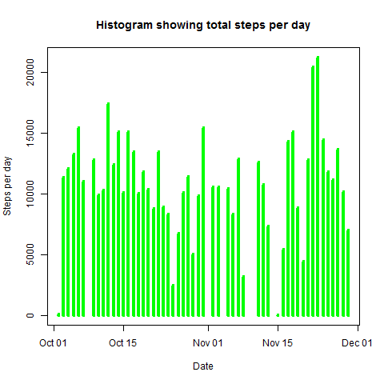
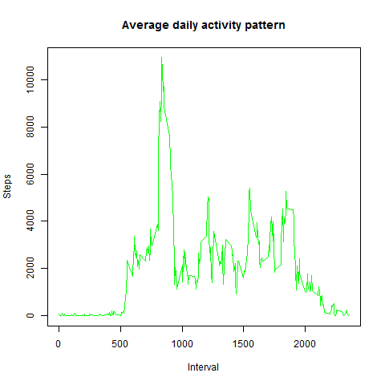

## Loading and preprocessing the data
Clear workspace using rm command as:
```r
rm(list = ls())
```
Unzip the activity dataset as:
```r
unzip(zipfile = "activity.zip")
```
Load the data into activity dataframe using read.csv() as:
```r
activity <- read.csv("data/activity.csv")
```
Convert date column of activity dataframe from factor to Date as:
```r
activity$date <- as.Date(activity$date)
```

## What is mean total number of steps taken per day?
Load dplyr package that will be used for manipulating data as:
```r
library('dplyr')
```
Calculate total steps per day by first filtering days with NA steps, then grouping by day and finally calculating total steps for the day as:
```r
stepsPerDay <- activity %>% filter(!is.na(steps)) %>% group_by(date) 
%>% summarise(totalSteps = sum(steps))
```
Plot histogram for the total steps taken per day using plot function as:
```r
plot(stepsPerDay$date, stepsPerDay$totalSteps,xlab = "Date", ylab = "Steps per day",
type = "h",col = 'green',lwd = 4)
```
 

Mean and median of total steps taken per day are calculated as:
```r
meanSteps <- mean(stepsPerDay$totalSteps)
medianSteps <- median(stepsPerDay$totalSteps)
```
The calculated mean and median are 10766.19 and 10765 steps respectively.

## What is the average daily activity pattern?
Calculate total steps per 5-minute interval by first filtering days with NA steps, then grouping by interval and finally calculating total steps for the interval as:
```r
stepsPerInterval <- activity %>% filter(!is.na(steps)) %>% group_by(interval) 
%>% summarise(totalSteps = sum(steps))
```
Plot time series plot for the total steps taken per interval as:
```r
plot(stepsPerInterval$interval, stepsPerInterval$totalSteps,xlab = "Interval", ylab = "Steps",
main = "Average daily activity pattern", type = "l",  col = "green")
```
 


## Imputing missing values


## Are there differences in activity patterns between weekdays and weekends?
